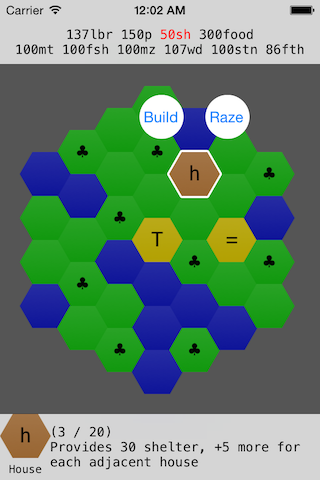

# Itza

A fun experiment to learn more about ReactiveCocoa.

Clearly it never got past the placeholder graphics phase.

Itza is a pocket-sized city-builder. It's not really *playable*, or, you know, a *game I will finish*, but it was a fun technological playground to experiment with libextobjc, UIKit animations, and ReactiveCocoa.

I made a little demo [gif of the app](demo.gif) (11 MB) so you don't have to download it.

## Running

Should work nicely up to XCode 6.1.1. Not tested on iOS 8. Just `pod install`, open the workspace, and you'll be good to go.
